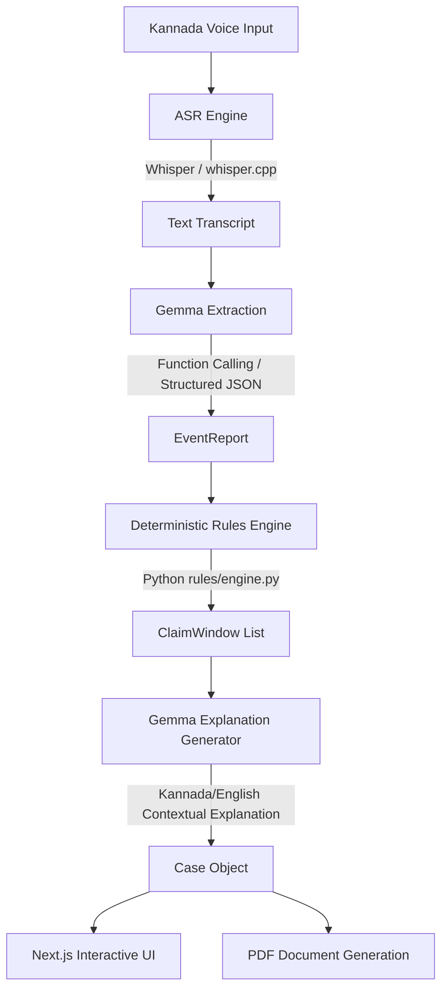
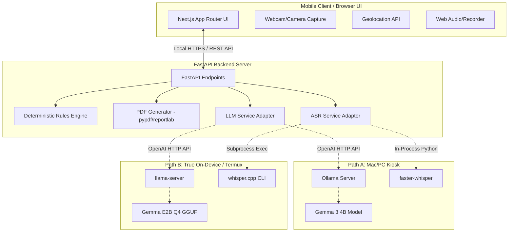

# Claim Window Navigator (Avadhi)

Voice-first, offline claim-deadline navigator for Indian insurance and welfare schemes.

Someone speaks in Kannada about a loss that just happened. The system automatically extracts event parameters, calculates running claim deadlines, compiles a secure evidence checklist, and generates a pre-filled PDF intimation form to carry to the bank or insurance officer. It runs entirely offline without internet connectivity.

---

## 🏛️ System Architecture

Avadhi is designed around a critical safety principle: **The language model never computes a deadline and never decides eligibility.** The model is used solely for extraction and natural language translation, while all deadline arithmetic is handled by a deterministic rules engine.

### Core Pipeline Flowchart



### Component Architecture & Deployment Paths



---

## 🔧 Deployment Architecture: Two Deployment Paths

Avadhi supports two execution environments, both running **100% offline**:

### Deployment Options Comparison

| Feature | Path A: Kiosk / Local Dev | Path B: True On-Device (Termux) |
|---|---|---|
| **Primary Device** | Mac / Laptop host | Android Device (e.g. S24) |
| **Gemma Server** | Ollama (`gemma3:4b`) | `llama.cpp`'s `llama-server` (`gemma-e2b-Q4_K_M.gguf`) |
| **ASR Engine** | `faster-whisper` (Python library) | `whisper.cpp` (Natively compiled binary CLI) |
| **Microphone Secure Origin** | Requires TLS certificates (`mkcert`) | Automatically secure (runs on `localhost`/`127.0.0.1`) |
| **Stage Claim** | "Offline village kiosk / Panchayat office" | "Completely offline on a single handheld phone" |
| **Setup Overhead** | 30 minutes | 3–5 hours |

---

## 🛠️ Step-by-Step Bring-Up Instructions

### Path A: Mac / PC Local Kiosk

#### A1. Run Ollama and Download Gemma
Ensure Ollama is installed and run:
```bash
ollama serve                      # Starts on 127.0.0.1:11434
ollama pull gemma3:4b             # Pulls the Gemma model
ollama list
```

#### A2. Backend Environment Setup
1. Setup Python virtual environment and dependencies:
   ```bash
   python -m venv .venv
   .venv\Scripts\activate          # On Windows
   source .venv/bin/activate        # On Mac/Linux
   pip install -r requirements.txt
   ```
2. Create `.env` in the root directory:
   ```ini
   BACKEND=server
   LLM_BASE_URL=http://127.0.0.1:11434
   MODEL_NAME=gemma3:4b
   ASR_BACKEND=whisper
   ASR_MODEL=small
   LANGUAGE=kn
   MOCK_MODE=false
   ```
3. Run the validation checks:
   ```bash
   pytest                           # Runs 110 automated tests
   python api/main.py               # Starts FastAPI on port 8000
   ```

#### A3. Next.js Frontend Setup (HTTPS for Microphone)
Modern browsers block audio/video capture on insecure non-localhost origins. If hosting on a laptop to demo on a mobile phone over a hotspot:
1. Identify your local IP address.
2. Generate local certificates (using `mkcert`):
   ```bash
   cd ui
   mkcert <laptop-ip> localhost 127.0.0.1
   mv <laptop-ip>+2-key.pem certs/key.pem
   mv <laptop-ip>+2.pem     certs/cert.pem
   npm install
   npm run dev:https
   ```
3. Connect the demo phone to the laptop's Wi-Fi / Hotspot.
4. Browse to `https://<laptop-ip>:3000` and allow the self-signed certificate.

---

### Path B: True On-Device (Termux)

#### B1. Setup Android Environment
Download Termux from **F-Droid** or GitHub (do not use Play Store).
```bash
pkg update && pkg upgrade
pkg install git cmake clang make python rust binutils ffmpeg wget
termux-setup-storage
```

#### B2. Compile and Serve Gemma via `llama.cpp`
Since `faster-whisper` and `mlx` cannot build easily on Android due to missing aarch64 wheels, `llama.cpp` is used to host Gemma:
```bash
git clone https://github.com/ggml-org/llama.cpp && cd llama.cpp
cmake -B build -DGGML_NATIVE=OFF && cmake --build build --config Release -j4
```
Download a GGUF format Gemma model (e.g. `gemma-2-2b-it`) and start the server:
```bash
./build/bin/llama-server -m ~/storage/shared/Download/gemma-2b-Q4_K_M.gguf --host 127.0.0.1 --port 8080 -c 4096
```

#### B3. Compile ASR via `whisper.cpp`
Build whisper.cpp natively on device:
```bash
cd ~
git clone https://github.com/ggml-org/whisper.cpp && cd whisper.cpp
cmake -B build && cmake --build build --config Release -j4
bash ./models/download-ggml-model.sh small
```

#### B4. Launch Python Backend inside Termux
1. Install Python packages (will compile Pydantic from source - takes ~20 min):
   ```bash
   pip install fastapi "uvicorn[standard]" pydantic python-multipart reportlab pypdf
   ```
2. Configure `.env` on the device:
   ```ini
   BACKEND=server
   LLM_BASE_URL=http://127.0.0.1:8080
   MODEL_NAME=gemma-e2b
   ASR_BACKEND=whispercpp
   WHISPERCPP_BIN=/data/data/com.termux/files/home/whisper.cpp/build/bin/whisper-cli
   WHISPERCPP_MODEL=/data/data/com.termux/files/home/whisper.cpp/models/ggml-small.bin
   LANGUAGE=kn
   MOCK_MODE=false
   ```
3. Export Next.js statically on the development machine and copy the files to the device:
   - Add `output: 'export'` to `ui/next.config.mjs`.
   - Run `npm run build` to generate `ui/out/`.
   - Copy `ui/out` to the phone and serve via FastAPI:
     ```python
     from fastapi.staticfiles import StaticFiles
     app.mount("/", StaticFiles(directory="ui/out", html=True), name="ui")
     ```
4. Start uvicorn:
   ```bash
   uvicorn api.main:app --host 127.0.0.1 --port 8000
   ```
5. Open Chrome on the phone and browse to `http://127.0.0.1:8000` (localhost bypasses HTTPS requirements).

---

## 🔒 Crucial Architectural Details for Judges

1. **The Deterministic Firewall**: Deadlines are computed using pure Python date arithmetic, factoring in RBI working days (banking holidays list included in `data/holidays.json`). No LLM calculations are used for numbers.
2. **ASR & LLM Separation**: Whisper/Whisper.cpp transcribes Kannada audio to text, which is parsed by Gemma using structured schema extraction.
3. **Lifespan Warmup**: Model loading and ASR startup checks are executed on backend boot inside `lifespan` hooks. Warmup is performed immediately to ensure the first speech transcription does not suffer from high latency or trigger cold-start failures.
4. **Timezone & Locale Integrity**: The entire engine is localized to IST (Indian Standard Time). Relative descriptors ("last night", "ನಿನ್ನೆ") are parsed via a load-bearing regex table configured specifically to prevent indic U+0CC6 character boundaries from failing.
5. **Language Adaptability**: Supports live language switching between English and Kannada. Toggling languages dynamically translates existing case cards on read using template engines, eliminating duplicate model calls.

---

## 📂 Project Directory Structure

```
├── api/
│   ├── config.py           # Configuration parser & env validation
│   ├── main.py             # FastAPI App router, CORS, Lifespan Hooks
│   ├── models/
│   │   └── schemas.py      # Frozen Pydantic Data Contract (freeze at T+4)
│   ├── routes/
│   │   ├── cases.py        # Case store access, ticks & photo routers
│   │   ├── document.py     # Endpoint generating pre-filled PDFs
│   │   ├── intake.py       # Speech recording ingest endpoint
│   │   └── profile.py      # Profile setup and completeness check
│   ├── rules/
│   │   ├── engine.py       # Deterministic rules engine (IST safe, pure function)
│   │   ├── loader.py       # JSON loader & relative timestamp parsing
│   │   └── workdays.py     # Banking calendar working-day calculator
│   └── services/
│       ├── asr.py          # ASR Adapter: faster-whisper or whisper.cpp
│       ├── cases.py        # JSON-based persistence & state machine
│       ├── document.py     # pypdf form filling implementation
│       ├── explain.py      # Natural language explanation generator
│       ├── extract.py      # Gemma parameter extractor
│       └── llm.py          # OpenAI/Ollama compatible server adapter
├── data/
│   ├── forms/              # Blank PMFBY, RBI Dispute, PMSBY forms
│   ├── schemes/            # Structured claim window JSON schemes (RBI, PMJJBY, PMSBY, PMFBY)
│   ├── holidays.json       # Indian bank holiday calendar list
│   └── cases.json          # Persistent on-disk database
├── ui/
│   ├── app/                # Next.js App Router (page.jsx, layout.jsx, globals.css)
│   ├── certs/              # HTTPS Dev certificate store (microphone context)
│   └── lib/
│       ├── adapt.js        # Adapter translating API schema to local state
│       └── api.js          # Unified API calls (Mock Mode support)
└── tests/                  # 110 Unit/Integration tests
```

---
